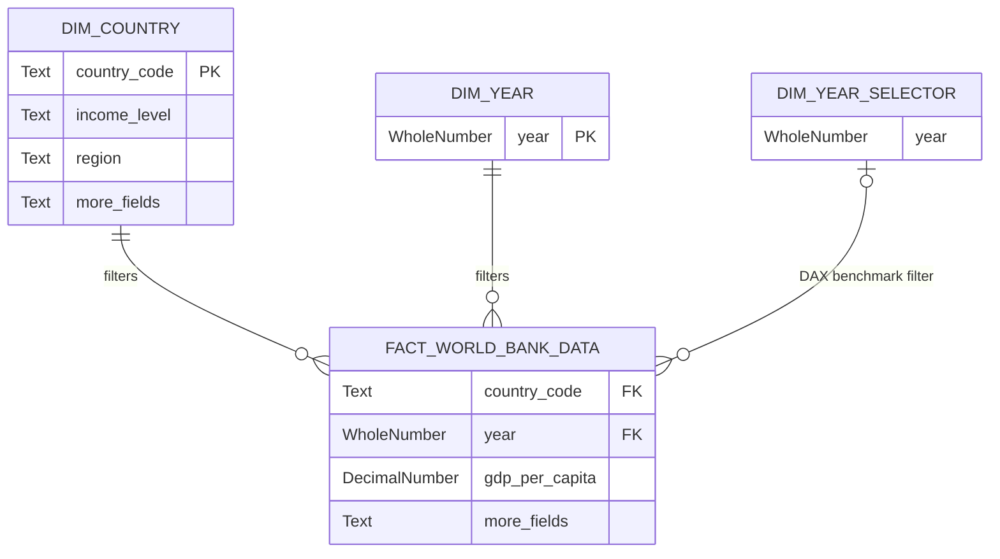

<div align="center">

# 🌍 World Bank: Global Economic Development & Income Distribution

### *Exploring two decades of global GDP, income inequality, and demographic shifts*


<br>


</div>

---

## 📌 Overview

This analytical project delivers an interactive, in-depth view of **global economic disparities**, income distribution, and GDP per capita growth over the last two decades.

Built on official data from the **World Bank — World Development Indicators (WDI)**, the dashboard enables exploration of demographic and economic structures at regional and country levels, all figures adjusted for **Purchasing Power Parity** *(PPP, constant 2021 international dollars)*.

> **Key scope:** 217 economies · 2000–2024 · PPP-adjusted · World Bank WDI

---

## 💡 Key Features

| Feature | Description |
|---|---|
| 🗺️ **Globe Map** | Orthographic choropleth visualizing GDP per capita concentration across hemispheres |
| 📖 **Smart Narrative** | Auto-updating KPI panel that adapts to every filter selection |
| 📊 **Growth Timeline** | Bar chart flagging recession years (red) vs. recovery phases (green) |
| 🔢 **Regional Matrix** | Population Share vs. GDP Share — exposing structural economic gaps |
| 📈 **Benchmarking** | Dual-line chart comparing any country's trajectory against the global average |
| 🎚️ **Timeline Slider** | Cross-filter control spanning 2000–2024 |

---

## 🏗️ Project Architecture

This repository uses the **Power BI Project (`.pbip`)** format for Git version control, keeping the semantic model and design code in plain text (JSON / TMDL) alongside a compiled `.pbix` for end-user delivery.

```text
worldbank-dashboard/
│
├── 📁 data/             # Static processed data (Excel/CSV) — local source of truth
├── 📁 semantic-model/   # ⚙️  SOURCE CODE (.pbip): model & design in plain text for Git
├── 📁 report/           # 🚀 DELIVERABLE (.pbix): compiled file ready for Power BI Desktop
├── 📁 dax/              # Documented DAX measures (complex metrics extracted for review)
└── 📁 assets/           # JSON themes, background templates, images
```

---

## ⚙️ Technical Specifications

### Data Model — Star Schema
 


**Star Schema** — contextual dimensions (`Dim Country`, `Dim Year`) are cleanly separated from the quantitative fact table for peak VertiPaq engine performance.

**Disconnected Slicer** — `Dim Year Selector` operates via DAX without an active model relationship, enabling benchmark comparisons that don't disturb the primary filter context.

---

### Advanced DAX Implementation

The semantic model goes beyond basic aggregations with three core patterns:

**① Macroeconomic Weighted Averages**
> `SUMX` + `DIVIDE` — regional and global GDP ratios weighted by population, avoiding distortions from simple averages.

**② Context Transition & Filter Overrides**
> `CALCULATE` + `REMOVEFILTERS` — dynamic baselines that preserve historical trends while a year filter is active.

**③ DAX-Driven UI/UX**
> `SWITCH` on HEX color codes to highlight negative growth years; conditional formatting to display `M` (millions) or `K` (thousands) based on filter context.

> 📁 All measure code is documented in the [`/dax`](./dax/) folder.

---

### UI/UX Design

- **Color System** — custom JSON theme aligned with World Bank corporate identity; blue-dominant, minimal chrome.
- **Layout** — structured grid guiding the eye from the global map → regional breakdown → country benchmarking.
- **Typography** — editorial hierarchy separating KPI values, labels, and narrative text for fast scanning.

---

## 🚀 How to Run

### ⚡ Option 1 — Quick View *(recommended)*

For interactivity and design exploration:

```bash
# 1. Clone the repository
git clone https://github.com/your-username/worldbank-dashboard.git

# 2. Open in Power BI Desktop
# Navigate to report/ and open World_Bank_Delivery.pbix
```

### 🔬 Option 2 — Architecture & Code Audit

For semantic model inspection and version control review:

```bash
# Navigate to semantic-model/
# Explore .SemanticModel and .Report folders (JSON + TMDL)
```

---

## ✉️ Contact

<div align="center">

**Yeison**
Data Analyst · Analytics Engineer

<br>

[](TU_LINK_DE_LINKEDIN)
[](TU_LINK_DEL_PORTAFOLIO)
[](mailto:TU_CORREO@gmail.com)

</div>