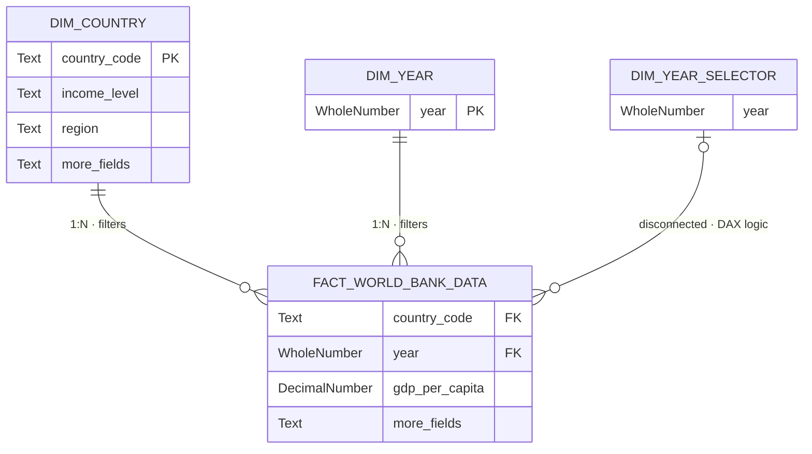

<div align="center">

# 🌍 World Bank: Global Economic Development & Income Distribution

### *Analytics Engineering Portfolio: Building a scalable semantic layer to explore two decades of global GDP and demographic shifts*


<br>


</div>

---

## 📌 Overview

This project demonstrates the design, optimization, and deployment of a robust **semantic layer** built to analyze global economic disparities, income distribution, and GDP per capita growth over the last two decades.

Engineered using official data from the **World Bank — World Development Indicators (WDI)**, the data model is optimized for the VertiPaq engine, enabling seamless exploration of **217 economies (2000–2024)**. All financial figures are dynamically adjusted for **Purchasing Power Parity** *(PPP, constant 2021 international dollars)*.

> **Analytics Engineering Focus:** Decoupled semantic model, version control readiness (CI/CD) via `.pbip`, advanced DAX aggregations, and structural data governance.

---

## 🛠️ Tech Stack & Tools

| Layer | Tools |
|---|---|
| **BI & Analytics** | Power BI Desktop, VertiPaq Engine |
| **Languages** | DAX (Data Analysis Expressions), M (Power Query) |
| **Version Control** | Git, Power BI Project (`.pbip`) |
| **Model Definition** | TMDL (Tabular Model Definition Language), JSON |

---

## 💡 Key Features & Smart UI

| Feature | Description |
|---|---|
| 🌐 **Globe Map** | Orthographic choropleth visualizing GDP per capita concentration across hemispheres |
| 🧠 **Smart Narrative** | Auto-updating KPI panel driven by DAX measures like `[Global Income Position]` and `[Economy in Focus]` to adapt contextually to every filter |
| 📉 **Growth Timeline** | Bar chart flagging recession years vs. recovery phases, powered by dynamic HEX color injection via `[GDP per Capita (PPP) Highlighted Color]` |
| 🔬 **Regional Matrix** | Population Share vs. GDP Share — exposing structural economic gaps globally |
| 🏅 **Benchmarking** | Dual-line chart using a disconnected slicer to compare any country's trajectory against the global average without breaking the filter context |

---

## 🎯 Business Value & Key Insights

A well-architected semantic layer must seamlessly answer complex business questions. The model's dynamic DAX architecture reveals the following macro-economic trends:

**The Global Divide:** In 2024, despite a global average income of **$21,621 (PPP)**, the model exposes extreme structural gaps: North America generates **16.4% of global GDP** with only **4.7% of the population**, while South Asia holds **20.7% of the population** but accounts for only **9.4% of the GDP**.

**Resilience Tracking:** The dynamic baselines accurately flag the **2020 global recession** across multiple regions, contrasting it directly with the **3.2% global recovery growth rate** marked in 2024.

---

## 🏗️ Project Architecture & Version Control

Moving away from monolithic `.pbix` files, this repository utilizes the **Power BI Project (`.pbip`)** structure. This code-first approach stores the semantic model and report design in plain text (TMDL/JSON), enabling Git version control, branch collaboration, and CI/CD pipeline integration.

```text
worldbank-dashboard/
│
├── 📁 data/             # Static processed data (Excel/CSV) — local source of truth
├── 📁 semantic-model/   # ⚙️  SEMANTIC LAYER (.pbip): TMDL definition of tables, relations, and DAX
├── 📁 report/           # 📊 PRESENTATION LAYER: JSON layout and visual configurations
├── 📁 dax/              # Code documentation for complex analytical patterns
└── 📁 assets/           # Custom JSON themes and structural background templates
```

---

## ⚙️ Engineering & Technical Specifications

### 🗂️ Data Model — Star Schema



**Strict Star Schema** — contextual dimensions (`Dim Country`, `Dim Year`) are fully decoupled from the quantitative fact table, minimizing memory footprint and maximizing VertiPaq compression.

**Disconnected Parameter Table** — `Dim Year Selector` operates purely via DAX without physical relationships, enabling complex historical trend comparisons without polluting the primary filter context.

---

### ⚡ Advanced DAX Implementation

The semantic layer is built with robust DAX patterns that prioritize mathematical accuracy, dynamic context transition, and a seamless user experience.

**① Population-Weighted Macroeconomic Aggregations**

To prevent statistical distortions from simple averages, core metrics like `[GDP per Capita (PPP)]` and `[Poverty Headcount Ratio]` utilize a `SUMX` iterator divided by total population — ensuring that massive economies properly weight regional and global aggregates.

```dax
// Core aggregation pattern used in the model
DIVIDE(
    SUMX(
        FILTER(
            'Fact World Bank Data',
            NOT ISBLANK( 'Fact World Bank Data'[gdp_per_capita] )
        ),
        'Fact World Bank Data'[gdp_per_capita] * 'Fact World Bank Data'[total_population]
    ),
    SUMX( ... )
)
```

**② Dynamic Benchmarking & Context Overrides**

The model dynamically identifies the top performer in a selected region using `TOPN` (`[Country with Highest GDP per Capita]`). It also uses `CALCULATE` combined with `REMOVEFILTERS('Dim Year Selector')` to maintain historical background trend lines even when strict year filters are applied via slicers.

**③ Context-Aware Formatting & UI/UX**

Instead of relying on native Power BI conditional formatting, the UI is programmatically driven by DAX:

- **Dynamic Scaling** — `[World Population Display]` evaluates `HASONEVALUE('Dim Country'[country_name])` via a `SWITCH` statement to format numbers as `M` (millions) or `K` (thousands) depending on the filter context granularity.
- **Smart Highlighting** — `[GDP per Capita (PPP) Highlighted Color]` injects HEX codes (e.g., `#B22222` for recession years, `#118DFF` for selected years) directly into visual elements based on the interaction between growth trends and the disconnected slicer.

> 📁 All complex measure code is extracted and documented in the [`/dax`](./dax/) folder for peer review.

---

### 🎨 UI/UX Design

- **Color System** — custom JSON theme aligned with World Bank corporate identity; blue-dominant, minimal chrome.
- **Layout** — structured grid guiding the eye from the global map → regional breakdown → country benchmarking.
- **Typography** — editorial hierarchy separating KPI values, labels, and narrative text for fast scanning.

---

## 🚀 Getting Started

### 📋 Prerequisites

| Requirement | Details |
|---|---|
| **Power BI Desktop** | May 2023 or newer — required to open `.pbip` source files |
| **Git** | Any recent version — required to clone the repository |
| **VS Code** *(optional)* | Recommended for TMDL and DAX syntax highlighting |

---

### ⚡ Option 1 — Run the Dashboard

> **Audience:** Anyone exploring the UI, KPIs, and business insights.

```bash
# 1. Clone the repository
git clone https://github.com/your-username/worldbank-dashboard.git

# 2. Navigate to the report folder and open in Power BI Desktop
cd worldbank-dashboard/report
# Open: World_Bank_Delivery.pbix
```

---

### 🔬 Option 2 — Audit the Semantic Model

> **Audience:** Analytics Engineers and technical reviewers inspecting the data model, DAX measures, and TMDL structure.

```bash
# 1. Clone the repository
git clone https://github.com/your-username/worldbank-dashboard.git

# 2. Open the semantic-model/ folder in VS Code
cd worldbank-dashboard/semantic-model

# Structure to review:
# ├── .SemanticModel/   → TMDL table definitions, relationships, and column types
# └── .Report/          → JSON visual layout and configuration
```

| Folder | Contents |
|---|---|
| `.SemanticModel/` | Table definitions, relationships, column types (TMDL) |
| `.Report/` | Visual layout, page config, theme references (JSON) |
| `dax/` | Extracted and documented DAX measure patterns |

---

## 🛣️ Roadmap — Future Enhancements

This project is continuously evolving. The following features and architectural improvements are planned for future releases:

- [ ] **Automated CI/CD Pipeline** — Implement GitHub Actions to automate the deployment of the `.pbip` semantic model directly to a Power BI Premium workspace upon merging to the `main` branch.
- [ ] **Data Governance & RLS** — Integrate dynamic Row-Level Security (RLS) to restrict regional data access based on user Active Directory roles.
- [ ] **Incremental Refresh** — Configure incremental refresh policies on `FACT_WORLD_BANK_DATA` to optimize VertiPaq memory usage as new yearly data is ingested.
- [ ] **Predictive Analytics** — Incorporate a Python-based forecasting model (via Power BI integration) to project GDP per capita trends for the next 5 years based on historical volatility.

---

## 🤝 Acknowledgments & Data Source

- Data provided by the **[World Bank Open Data](https://data.worldbank.org/)** portal.
- Indicators: **GDP per capita, PPP** *(constant 2021 international $)* & **Population totals**.

---

## ✉️ Contact

<div align="center">

**Yeison**
Data Analyst · Analytics Engineer

<br>

[](TU_LINK_DE_LINKEDIN)
[](TU_LINK_DEL_PORTAFOLIO)
[](mailto:TU_CORREO@gmail.com)

</div>