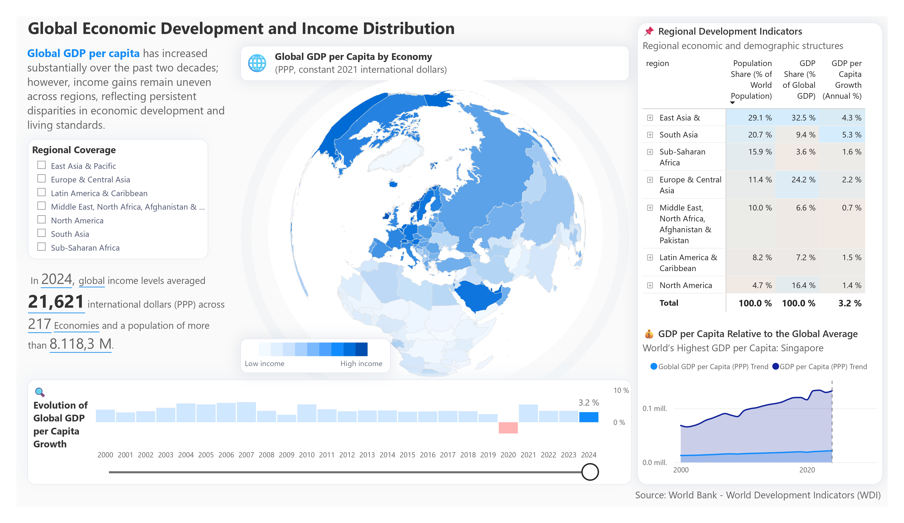

<div align="center">

# 🌍 World Bank: Global Economic Development & Income Distribution

### *Analytics Engineering Portfolio: Building a scalable semantic layer to explore two decades of global GDP and demographic shifts*


<br>



</div>

---

## 📌 Overview

This project demonstrates the design, optimization, and deployment of a robust **semantic layer** built to analyze global economic disparities, income distribution, and GDP per capita growth over the last two decades.

Engineered using official data from the **World Bank — World Development Indicators (WDI)**, the data model is optimized for the VertiPaq engine, enabling seamless exploration of **217 economies (2000–2024)**. All financial figures are dynamically adjusted for **Purchasing Power Parity** *(PPP, constant 2021 international dollars)*.

> **Analytics Engineering Focus:** Decoupled semantic model, version control readiness (CI/CD) via `.pbip`, advanced DAX aggregations, and structural data governance.

---

## 🛠️ Tech Stack & Tools

| Layer | Tools |
|---|---|
| **BI & Analytics** | Power BI Desktop, VertiPaq Engine |
| **Languages** | DAX (Data Analysis Expressions), M (Power Query) |
| **Version Control** | Git, Power BI Project (`.pbip`) |
| **Model Definition** | TMDL (Tabular Model Definition Language), JSON |

---

## 💡 Key Features & Smart UI

| Feature | Description |
|---|---|
| 🌐 **Globe Map** | Orthographic choropleth visualizing GDP per capita concentration across hemispheres |
| 🧠 **Smart Narrative** | Auto-updating KPI panel driven by `[Global Income Position]` and `[Economy in Focus]` — adapts contextually to every filter |
| 📉 **Growth Timeline** | Bar chart flagging recession years vs. recovery phases via dynamic HEX color injection — `[GDP per Capita (PPP) Highlighted Color]` |
| 🔬 **Regional Matrix** | `[Population Share]` vs. `[GDP Share]` — exposing structural economic gaps at regional granularity |
| 🏅 **Benchmarking** | Dual-line chart powered by `[GDP per Capita (PPP) Trend]` — compares any country or region against the global average without breaking the filter context |

---

## 🎯 Business Value & Key Insights

A well-architected semantic layer must seamlessly answer complex business questions. The model's dynamic DAX architecture surfaces the following macro-economic trends:

**The Global Divide:** In 2024, despite a global average income of **$21,621 (PPP)**, the model exposes extreme structural gaps: North America generates **16.4% of global GDP** with only **4.7% of the population**, while South Asia holds **20.7% of the population** but accounts for only **9.4% of the GDP**.

**Resilience Tracking:** The dynamic baselines accurately flag the **2020 global recession** across multiple regions, contrasting it directly with the **3.2% global recovery growth rate** marked in 2024.

---

## 🏗️ Project Architecture & Version Control

Moving away from monolithic `.pbix` files, this repository uses the **Power BI Project (`.pbip`)** structure — a code-first approach that serializes the semantic model and report design into plain text (TMDL/JSON), enabling Git version control, branch collaboration, and CI/CD pipeline integration.

```text
worldbank-dashboard/
│
├── 📁 data/             # Static processed data (Excel/CSV) — local source of truth
├── 📁 semantic-model/   # ⚙️  SEMANTIC LAYER (.pbip): TMDL definition of tables, relations, and DAX
├── 📁 report/           # 📊 PRESENTATION LAYER: JSON layout and visual configurations
├── 📁 dax/              # Documented DAX measure patterns for peer review
└── 📁 assets/           # Custom JSON themes and structural background templates
```

---

## ⚙️ Engineering & Technical Specifications

### 🗂️ Data Model — Star Schema

The semantic layer follows a strict **Star Schema** optimized for the VertiPaq engine:

- **Decoupled Dimensions** — `Dim Country` and `Dim Year` are fully separated from the fact table, minimizing memory footprint and maximizing VertiPaq compression ratios.
- **Disconnected Parameter Table** — `Dim Reference Year` has no active physical relationship. It operates exclusively via `TREATAS` and `SELECTEDVALUE` in DAX, enabling point-in-time benchmarking without polluting the primary filter context.

> 🗂️ Full schema diagram, table definitions, field glossary, and relationship map → [`docs/data-model.md`](./docs/data-model.md)

---

### ⚡ Advanced DAX Implementation

The semantic layer is built on three core DAX engineering patterns:

**① Population-Weighted Macroeconomic Aggregations**

Core KPIs like `[GDP per Capita (PPP)]` and `[Poverty Headcount Ratio]` use a population-weighted `SUMX` iterator to prevent the statistical distortions caused by simple averages — ensuring that large economies carry their proper weight in regional and global aggregates.

```dax
-- Pattern: Population-weighted average (used across all core KPIs)
DIVIDE(
    SUMX(
        FILTER(
            'Fact World Bank Data',
            NOT ISBLANK( 'Fact World Bank Data'[gdp_per_capita] )
        ),
        'Fact World Bank Data'[gdp_per_capita] * 'Fact World Bank Data'[total_population]
    ),
    SUMX(
        FILTER(
            'Fact World Bank Data',
            NOT ISBLANK( 'Fact World Bank Data'[gdp_per_capita] )
        ),
        'Fact World Bank Data'[total_population]
    )
)
```

**② Virtual Filter Injection via `TREATAS`**

Instead of relying on an active model relationship, all base KPIs inject the selected reference year as a virtual filter context using `TREATAS(VALUES('Dim Reference Year'[Year]), 'Dim Year'[year])`. This pattern decouples the UI control from the physical model, preserving the historical trend lines used in background charts.

**③ Context-Aware Formatting & UI/UX**

The UI is programmatically driven by DAX — no native conditional formatting panels:

- **Dynamic Scaling** — `[World Population Display]` uses `HASONEVALUE` + `SWITCH` to format values as `M` (millions) or `K` (thousands) based on filter granularity.
- **Smart Highlighting** — `[GDP per Capita (PPP) Highlighted Color]` injects `#B22222` (recession), `#118DFF` (selected year), `#FFB3B3` / `#CFE7FF` (contextual) directly into visual color bindings.
- **Dynamic Labels** — `[Economy in Focus]`, `[Benchmark Economy]`, and `[Economic Scope Label]` adapt narrative text to the active filter context (country / region / global).

> 📁 All measure code is extracted and documented in the [`/dax`](./dax/) folder for peer review.

---

### 🎨 UI/UX Design

- **Color System** — custom JSON theme aligned with World Bank corporate identity; blue-dominant, minimal chrome.
- **Layout** — structured grid guiding the eye: global map → regional breakdown → country benchmarking.
- **Typography** — editorial hierarchy separating KPI values, axis labels, and narrative text for fast scanning.

---

## 🚀 Getting Started

### 📋 Prerequisites

| Requirement | Details |
|---|---|
| **Power BI Desktop** | May 2023 or newer — required to open `.pbip` source files |
| **Git** | Any recent version — required to clone the repository |
| **VS Code** *(optional)* | Recommended for TMDL and DAX syntax highlighting |

---

### ⚡ Option 1 — Run the Dashboard

> **Audience:** Anyone exploring the UI, KPIs, and business insights.

```bash
# 1. Clone the repository
git clone https://github.com/your-username/worldbank-dashboard.git

# 2. Navigate to the report folder and open in Power BI Desktop
cd worldbank-dashboard/report
# Open: World_Bank_Delivery.pbix
```

---

### 🔬 Option 2 — Audit the Semantic Model

> **Audience:** Analytics Engineers and technical reviewers inspecting the data model, DAX measures, and TMDL structure.

```bash
# 1. Clone the repository
git clone https://github.com/your-username/worldbank-dashboard.git

# 2. Open the semantic-model/ folder in VS Code
cd worldbank-dashboard/semantic-model

# Structure to review:
# ├── .SemanticModel/   → TMDL table definitions, relationships, and column types
# └── .Report/          → JSON visual layout and configuration
```

| Folder | Contents |
|---|---|
| `.SemanticModel/` | Table definitions, relationships, column types (TMDL) |
| `.Report/` | Visual layout, page config, theme references (JSON) |
| `dax/` | Extracted and documented DAX measure patterns |

---

## 🛣️ Roadmap — Future Enhancements

This project is continuously evolving. The following features and architectural improvements are planned for future releases:

- [ ] **Automated CI/CD Pipeline** — GitHub Actions to deploy the `.pbip` semantic model directly to a Power BI Premium workspace on merge to `main`.
- [ ] **Data Governance & RLS** — Dynamic Row-Level Security (RLS) restricting regional data access based on Active Directory user roles.
- [ ] **Incremental Refresh** — Incremental refresh policies on `FACT_WORLD_BANK_DATA` to optimize VertiPaq memory as new yearly WDI data is ingested.
- [ ] **Predictive Analytics** — Python-based GDP per capita forecasting model (via Power BI integration) projecting 5-year trends based on historical volatility.

---

## 🤝 Acknowledgments & Data Source

- Data provided by the **[World Bank Open Data](https://data.worldbank.org/)** portal — World Development Indicators (WDI).
- Indicators: **GDP per capita, PPP** *(constant 2021 international $)*, **Gini index**, **Poverty headcount ratio**, and **Population totals**.

---

## ✉️ Contact

<div align="center">

**Yeison**
Data Analyst · Analytics Engineer

<br>

[](TU_LINK_DE_LINKEDIN)
[](TU_LINK_DEL_PORTAFOLIO)
[](mailto:TU_CORREO@gmail.com)

</div>