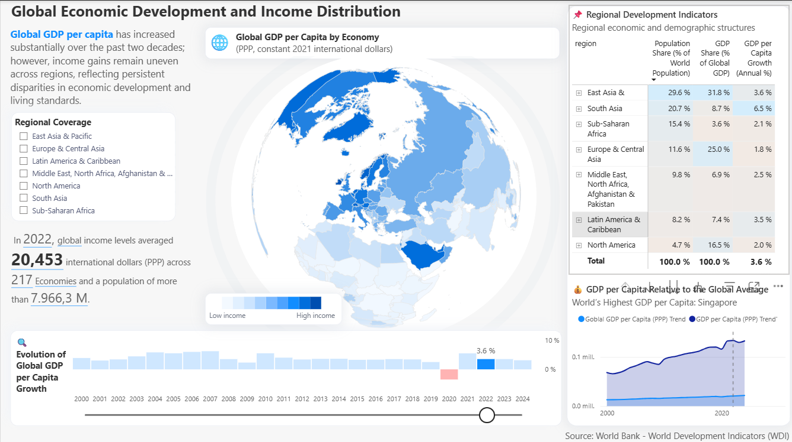
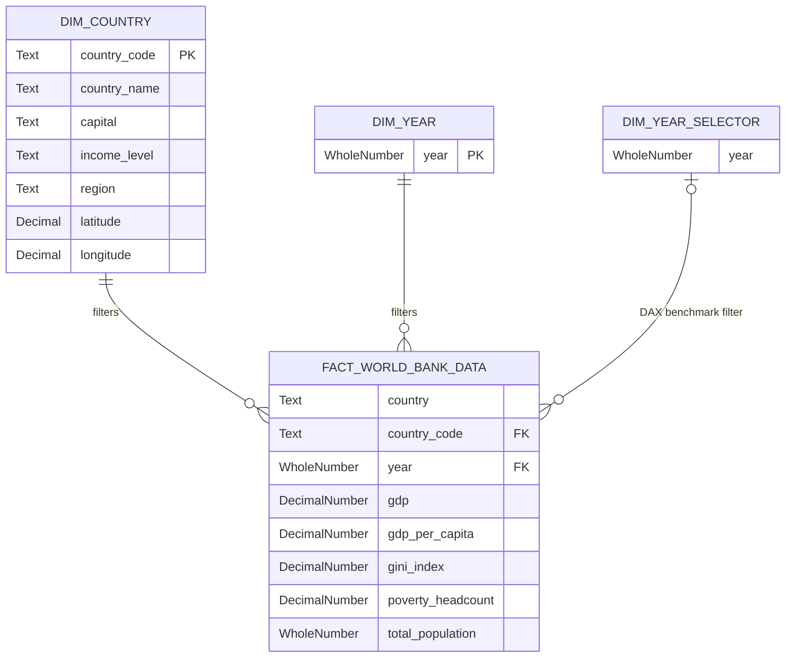

# 🌍 World Bank: Global Economic Development & Income Distribution


## 📌 Overview

This analytical project provides an interactive and in-depth view of global economic disparities, income distribution, and GDP per capita growth over the last two decades.

Developed using official data from the **World Bank — World Development Indicators (WDI)**, the dashboard allows users to explore demographic and economic structures at regional and country levels, adjusted for Purchasing Power Parity (PPP in constant 2021 international dollars).

<div align="center">
  
</div>

---

## 🏗️ Project Architecture

To demonstrate best practices in **Analytics Engineering and BI development**, this repository uses the **Power BI Project (`.pbip`)** format for Git version control. This allows keeping the data and design code in plain text (JSON/TMDL), while also providing a compiled file (`.pbix`) for easy visualization and interaction.

```text
worldbank-dashboard/
├── data/           # Static processed data (Excel/CSV) - Local source of truth
├── semantic-model/ # ⚙️ SOURCE CODE (.pbip): Semantic model and design in plain text for Git
├── report/         # 🚀 DELIVERABLE (.pbix): Compiled file ready for end-users
├── dax/            # Code repository for extracted complex metrics
└── assets/         # Visual resources (JSON Themes, backgrounds, images)
```

---

## 💡 Key Features & Visual Analysis

**Dynamic Data Storytelling:** A smart narrative panel that automatically updates key metrics based on user filters — for example, highlighting that in 2022, global income levels averaged **20,453 international dollars (PPP)** across **217 Economies** and a population of over **7,966.3 M**.

**Advanced Geospatial Mapping (Globe Map):** An orthographic map illustrating Global GDP per Capita by Economy. The custom blue color scale instantly highlights the concentration of wealth across hemispheres.

**Interactive Filtering System:**
- A **Regional Coverage** slicer to isolate specific continents (e.g., East Asia & Pacific, Sub-Saharan Africa).
- A dynamic **Timeline Slider** at the bottom, enabling seamless cross-filtering from 2000 to 2024.

**Historical Impact & Volatility:** The *Evolution of Global GDP per Capita Growth* chart visually flags negative growth periods (e.g., the red bar during the 2020 global recession) versus recovery phases (e.g., 3.6% growth in 2022).

**Regional Decomposition Matrix:** A detailed tabular view contrasting **Population Share** (% of World Population) against **GDP Share** (% of Global GDP), clearly exposing structural economic gaps.

**Relative Benchmarking:** A dual-line chart (*GDP per Capita Relative to the Global Average*) evaluating a specific country's performance — e.g., Singapore — against the overarching Global GDP Trend.

---

## ⚙️ Technical Specifications

### Data Modeling & Architecture
 


**Star Schema:** Optimized dimensional modeling separating contextual dimensions (`Dim Country`, `Dim Year`) from the quantitative fact table (`Fact World Bank Data`) for peak VertiPaq engine performance.

**Disconnected Tables for Benchmarking:** Implementation of a detached parameter table (`Dim Year Selector`) to allow dynamic benchmark comparisons without disrupting the primary historical filter context.

### Advanced DAX Implementation

The semantic model features enterprise-grade DAX, moving beyond basic aggregations:

- **Macroeconomic Weighted Averages:** Utilizing `SUMX` and `DIVIDE` to calculate accurate regional/global GDP and Poverty ratios weighted by population size, avoiding statistical distortions from simple averages.

- **Context Transition & Filter Overrides:** Extensive use of `CALCULATE` combined with `REMOVEFILTERS` to build dynamic baselines (e.g., preserving historical trends while filtering specific years).

- **DAX-Driven UI/UX:** Dynamic injection of HEX color codes (`SWITCH`) to highlight specific data points (e.g., negative growth years) and intelligent number formatting (conditionally displaying `'M'` for millions or `'K'` for thousands based on filter context).

> 📝 The code for the main measures is documented in the `/dax/` folder.

### UI/UX Design

- **Color Palette:** Custom theme (JSON) inspired by the World Bank's corporate identity, prioritizing a clean, minimal interface.
- **Navigation:** Structured grid layout system that guides the user's eye from the high-level global map to specific regional tables and trend lines.

---

## 🚀 How to Run This Project

There are two ways to explore this repository depending on the level of detail you wish to consult:

### Option 1: Quick View *(Recommended for interaction)*

If you want to open the dashboard directly to test its interactivity and design:

1. Clone or download this repository to your local machine.
2. Navigate to the `report/` folder.
3. Open the `World_Bank_Delivery.pbix` file with **Power BI Desktop**. The model and charts will load automatically.

### Option 2: Architecture & Code Audit

If you want to inspect the semantic model structure and version control setup:

1. Clone the repository.
2. Navigate to the `semantic-model/` folder.
3. Open the `.pbip` (Power BI Project) file. Explore the natively generated `.SemanticModel` and `.Report` folders to review code serialization in JSON and TMDL formats.

---

## ✉️ Contact

**[Tu Nombre / Tu Apellido]**<br>
Data Analyst / Analytics Engineer

[](TU_LINK_DE_LINKEDIN)
[](TU_LINK_DEL_PORTAFOLIO)
[](mailto:TU_CORREO@gmail.com)