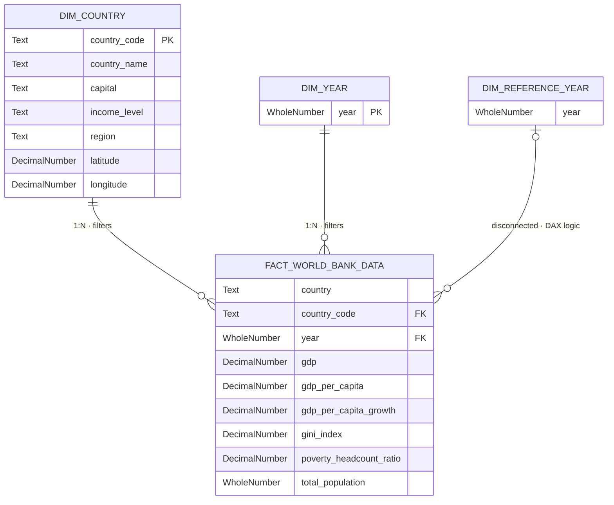

# 🗂️ Data Model Documentation

> Part of the [World Bank: Global Economic Development & Income Distribution](../README.md) project.  
> Last updated to reflect the current semantic model in `semantic-model/`.

---

## 🏗️ Architecture — Star Schema

The semantic layer is structured as a **strict Star Schema**, optimized for the VertiPaq compression engine in Power BI. Contextual dimensions are fully decoupled from the quantitative fact table to minimize memory footprint and maximize query performance.

---

## 📋 Tables

### 🌍 `DIM_COUNTRY` — Country Dimension

Contextual dimension containing geographic, demographic, and income classification attributes for each economy.

| Field | Type | Role | Description |
|---|---|---|---|
| `country_code` | Text | PK | ISO 3166-1 alpha-3 country identifier |
| `country_name` | Text | — | Full official country name |
| `capital` | Text | — | Capital city |
| `income_level` | Text | — | World Bank income classification: Low / Lower-middle / Upper-middle / High |
| `region` | Text | — | World Bank regional grouping (e.g. East Asia & Pacific, Sub-Saharan Africa) |
| `latitude` | Decimal Number | — | Geographic latitude — used for Globe Map visual |
| `longitude` | Decimal Number | — | Geographic longitude — used for Globe Map visual |

---

### 📅 `DIM_YEAR` — Year Dimension

Standard date dimension enabling time-based filtering and cross-filtering across all report pages.

| Field | Type | Role | Description |
|---|---|---|---|
| `year` | Whole Number | PK | Calendar year — active range: 2000–2024 |

---

### 📊 `FACT_WORLD_BANK_DATA` — Fact Table

Central quantitative table containing all World Bank economic and demographic indicators, granular at the country × year level.

| Field | Type | Role | Description |
|---|---|---|---|
| `country` | Text | — | Country name — denormalized for display layer |
| `country_code` | Text | FK → `DIM_COUNTRY` | ISO 3166-1 alpha-3 country code |
| `year` | Whole Number | FK → `DIM_YEAR` | Calendar year |
| `gdp` | Decimal Number | Measure | Total GDP, PPP (constant 2021 international $) |
| `gdp_per_capita` | Decimal Number | Measure | GDP per capita, PPP (constant 2021 international $) |
| `gdp_per_capita_growth` | Decimal Number | Measure | Annual GDP per capita growth rate (%) |
| `gini_index` | Decimal Number | Measure | Gini coefficient — income inequality index (0–100) |
| `poverty_headcount_ratio` | Decimal Number | Measure | Population below $2.15/day (% of total population) |
| `total_population` | Whole Number | Measure | Total population |

---

### ⚡ `DIM_REFERENCE_YEAR` — Disconnected Parameter Table

A parameter table with **no active physical relationship** to the fact table. It operates exclusively via DAX `TREATAS` and `SELECTEDVALUE` patterns to enable point-in-time KPI snapshots and benchmark comparisons without polluting the primary historical filter context.

| Field | Type | Role | Description |
|---|---|---|---|
| `year` | Whole Number | — | Selected reference year — drives all base KPI measures via `TREATAS` |

> **Why disconnected?**  
> An active relationship would propagate the slicer's year filter directly to the fact table, collapsing the historical trend lines used in background charts. The disconnected pattern lets `TREATAS(VALUES('Dim Reference Year'[Year]), 'Dim Year'[year])` inject the selected year as a virtual filter — scoped only to the measures that need it — while `DIM_YEAR` remains free to drive the full timeline.

---

## 🔗 Relationships

| From | To | Cardinality | Type | DAX Pattern |
|---|---|---|---|---|
| `DIM_COUNTRY[country_code]` | `FACT_WORLD_BANK_DATA[country_code]` | 1:N | Active | Standard filter propagation |
| `DIM_YEAR[year]` | `FACT_WORLD_BANK_DATA[year]` | 1:N | Active | Standard filter propagation |
| `DIM_REFERENCE_YEAR[year]` | `FACT_WORLD_BANK_DATA[year]` | — | **Disconnected** | `TREATAS` virtual filter injection |

---

## 📐 DAX Measure Inventory

All measures live in the `'Measure'` table. Grouped by function:

| Group | Measures |
|---|---|
| **Base KPIs** | `[Total Population]`, `[GDP (PPP)]`, `[GDP per Capita (PPP)]`, `[GDP per Capita Growth (Annual %)]`, `[Poverty Headcount Ratio]`, `[Total Economies]` |
| **Global Baselines** | `[Global GDP per Capita (PPP)]`, `[Global GDP per Capita (PPP) Trend]` |
| **Trend Lines** | `[GDP per Capita Growth Trend]`, `[GDP per Capita (PPP) Trend]` |
| **Benchmarking** | `[Country with Highest GDP per Capita]`, `[Benchmark Economy]`, `[Economy in Focus]` |
| **Share Ratios** | `[Population Share (% of World Population)]`, `[GDP Share (% of Global GDP)]` |
| **UI & Formatting** | `[World Population Display]`, `[Global Income Position]`, `[Economic Scope Label]`, `[Legend Placeholder]` |
| **Highlighting** | `[GDP per Capita (PPP) Highlighted Color]`, `[GDP per Capita Highlighted Value]`, `[GDP per Capita Growth Highlighted Value]`, `[Year Highlighted Value]` |

> 📁 Full measure code documented in [`/dax`](../dax/) folder.

---

## 🌐 Data Source

All data is sourced from the **[World Bank Open Data](https://data.worldbank.org/)** portal — World Development Indicators (WDI).

| Indicator | Field in Model | WDI Code |
|---|---|---|
| GDP, PPP (constant 2021 international $) | `gdp` | `NY.GDP.MKTP.PP.KD` |
| GDP per capita, PPP (constant 2021 international $) | `gdp_per_capita` | `NY.GDP.PCAP.PP.KD` |
| GDP per capita growth (annual %) | `gdp_per_capita_growth` | `NY.GDP.PCAP.KD.ZG` |
| Gini index | `gini_index` | `SI.POV.GINI` |
| Poverty headcount ratio at $2.15/day | `poverty_headcount_ratio` | `SI.POV.DDAY` |
| Population, total | `total_population` | `SP.POP.TOTL` |

---

*→ Back to [README](../README.md)*