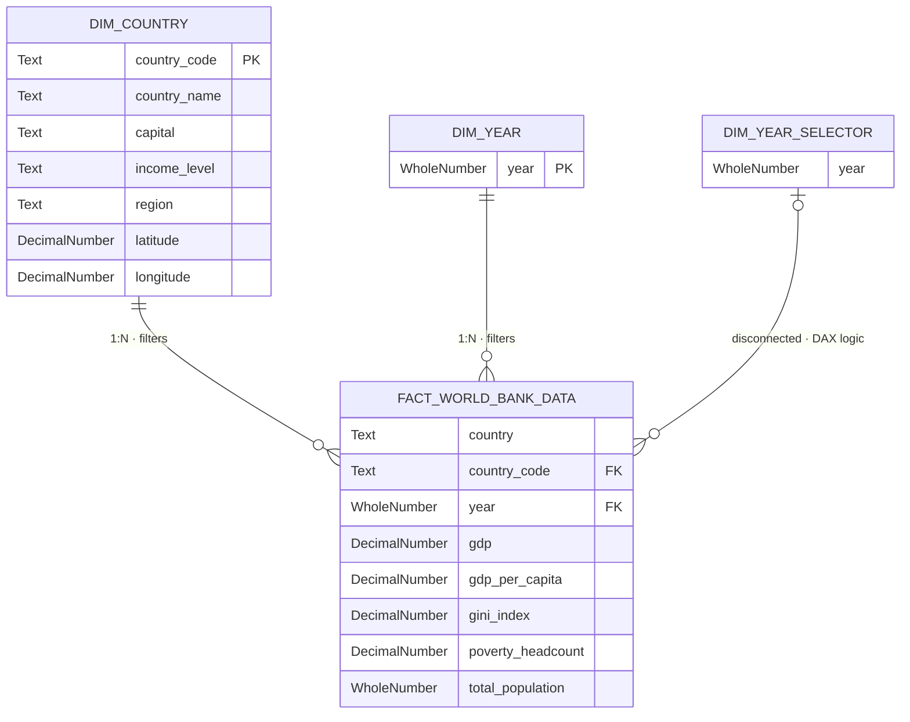

# 📐 Data Model Documentation

> Part of the [World Bank: Global Economic Development & Income Distribution](../README.md) project.

---

## Architecture — Star Schema

The semantic layer is structured as a **strict Star Schema**, optimized for the VertiPaq compression engine in Power BI. Contextual dimensions are fully decoupled from the quantitative fact table to minimize memory footprint and maximize query performance.

---

## Tables

### `DIM_COUNTRY` — Country Dimension

Contextual dimension containing geographic, demographic, and classification attributes for each economy.

| Field | Type | Role | Description |
|---|---|---|---|
| `country_code` | Text | PK | ISO 3166-1 alpha-3 country code |
| `country_name` | Text | — | Full official country name |
| `capital` | Text | — | Capital city |
| `income_level` | Text | — | World Bank income classification (Low, Lower-middle, Upper-middle, High) |
| `region` | Text | — | World Bank regional grouping (e.g. East Asia & Pacific) |
| `latitude` | Decimal Number | — | Geographic latitude — used for map visuals |
| `longitude` | Decimal Number | — | Geographic longitude — used for map visuals |

---

### `DIM_YEAR` — Year Dimension

Simple date dimension enabling time-based filtering and cross-filtering across the report.

| Field | Type | Role | Description |
|---|---|---|---|
| `year` | Whole Number | PK | Calendar year (2000–2024) |

---

### `FACT_WORLD_BANK_DATA` — Fact Table

Central quantitative table containing all economic and demographic indicators per country per year.

| Field | Type | Role | Description |
|---|---|---|---|
| `country` | Text | — | Country name (denormalized for display) |
| `country_code` | Text | FK → `DIM_COUNTRY` | ISO 3166-1 alpha-3 country code |
| `year` | Whole Number | FK → `DIM_YEAR` | Calendar year |
| `gdp` | Decimal Number | Measure | Total GDP in PPP (constant 2021 international $) |
| `gdp_per_capita` | Decimal Number | Measure | GDP per capita in PPP (constant 2021 international $) |
| `gini_index` | Decimal Number | Measure | Gini coefficient — income inequality index (0–100) |
| `poverty_headcount` | Decimal Number | Measure | Poverty headcount ratio at $2.15/day (% of population) |
| `total_population` | Whole Number | Measure | Total population |

---

### `DIM_YEAR_SELECTOR` — Disconnected Parameter Table

A parameter table with **no active physical relationship** to the fact table. It operates exclusively via DAX to enable benchmark comparisons (e.g. a selected reference year vs. the full historical trend) without polluting the primary filter context.

| Field | Type | Role | Description |
|---|---|---|---|
| `year` | Whole Number | — | Selected reference year for DAX-driven benchmarking |

> **Why disconnected?** Using an active relationship would propagate the year filter to the fact table, breaking background trend lines. The disconnected approach lets DAX measures read the selected year via `SELECTEDVALUE('Dim Year Selector'[year])` while the main timeline remains unfiltered.

---

## Relationships

| From | To | Cardinality | Type | Purpose |
|---|---|---|---|---|
| `DIM_COUNTRY[country_code]` | `FACT_WORLD_BANK_DATA[country_code]` | 1:N | Active | Filters fact table by country attributes |
| `DIM_YEAR[year]` | `FACT_WORLD_BANK_DATA[year]` | 1:N | Active | Filters fact table by year |
| `DIM_YEAR_SELECTOR[year]` | `FACT_WORLD_BANK_DATA[year]` | 1:N | **Disconnected** | DAX-only benchmark filter |

---

## Data Source

All data is sourced from the **[World Bank Open Data](https://data.worldbank.org/)** portal — World Development Indicators (WDI).

| Indicator | WDI Code |
|---|---|
| GDP, PPP (constant 2021 international $) | `NY.GDP.MKTP.PP.KD` |
| GDP per capita, PPP (constant 2021 international $) | `NY.GDP.PCAP.PP.KD` |
| Gini index | `SI.POV.GINI` |
| Poverty headcount ratio at $2.15/day | `SI.POV.DDAY` |
| Population, total | `SP.POP.TOTL` |

---

*→ Back to [README](../README.md)*
